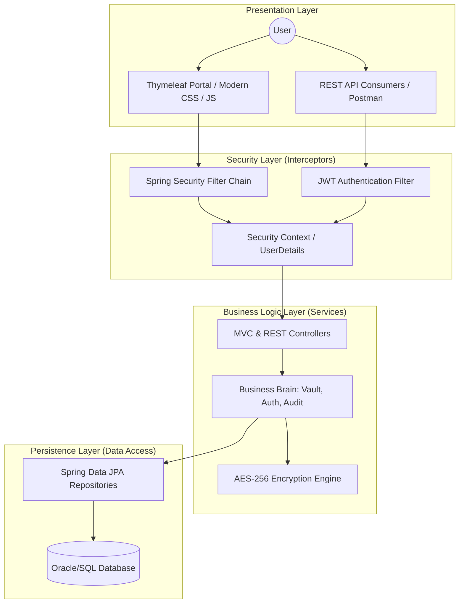
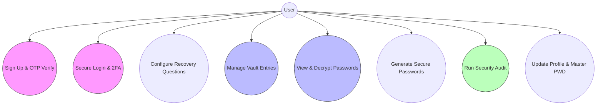
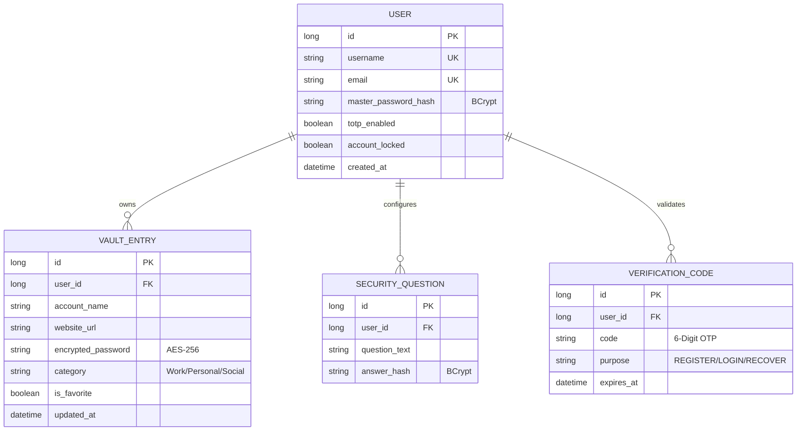
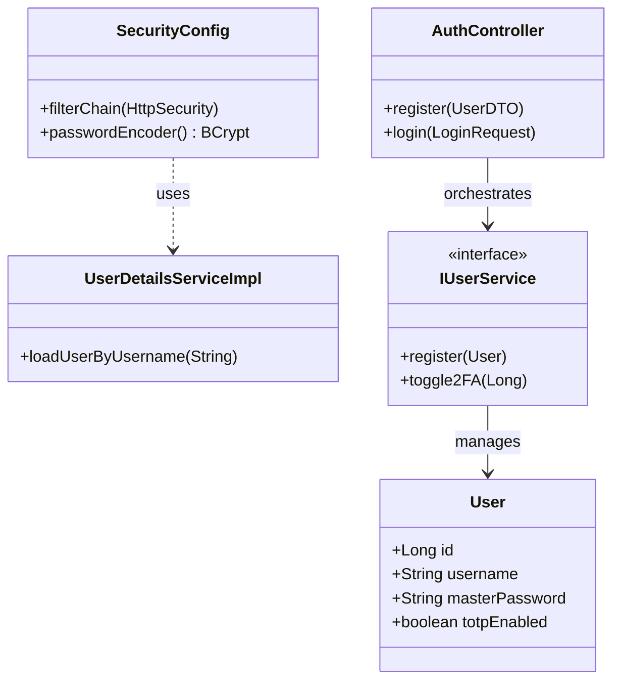
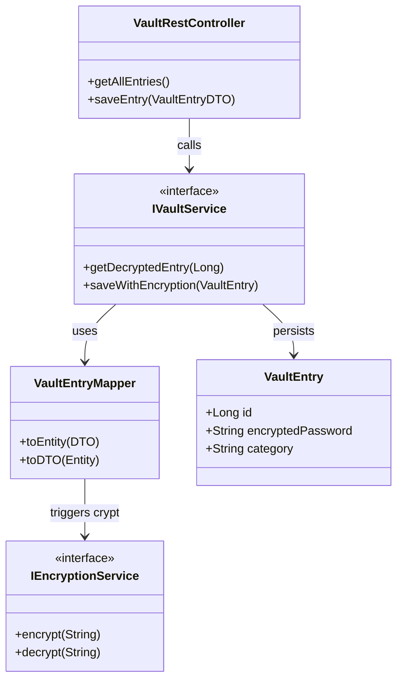
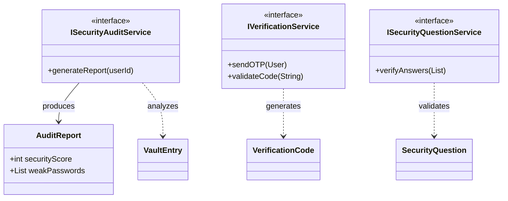

# 🏛️ RevPassword Manager: Comprehensive Technical Architecture

## 1. Project Introduction
**RevPassword Manager (RevSecurity)** is a high-security, 4-tier web application designed to help users securely store, organize, and manage their digital credentials. Built on **Spring Boot 3** and powered by **AES-256 block-cipher encryption**, the system ensures that sensitive data is protected at rest, even if the underlying database is compromised. 

The application utilizes **Thymeleaf** for a rich administrative web interface and a stateless **REST API** with **JWT** for programmatic interactions. Security is a first-class citizen, featuring Multi-Factor Authentication (OTP), security questions for recovery, and a comprehensive security audit engine to identify weak or old passwords.

---

## 2. System Diagram (Architecture Overview)
This diagram illustrates the high-level 4-tier architecture, showing how user requests flow from the presentation layer down to the persistence layer through security and logic filters.

---

## 3. Use Case Diagram
This diagram defines the primary interactions between the **System Actor (User)** and the application's core functionality.

---

## 4. Entity Relationship (ER) Diagram
The data model is optimized for security and integrity, utilizing one-to-many relationships for user-owned assets.

---

## 5. Class Diagrams (Module Breakdown)

### 📂 Module 1: Authentication & Identity Management

### 📂 Module 2: Password Vault Engine

### 📂 Module 3: Security Verification & Audit

---

## 🛡️ Summary of Technical Implementation
1.  **Encryption Strategy**: Uses **AES/CBC/PKCS5Padding** for reversible encryption of vault secrets; **BCrypt** for non-reversible hashing of credentials.
2.  **Stateless Security**: REST endpoints are guarded by a manual **JWT filter** ensuring no server-side session overhead for API consumers.
3.  **Data Persistence**: Uses **Spring Data JPA** with custom repository methods like `findByUserIdOrderByAccountNameAsc` to handle complex sorting and retrieval efficiently.
