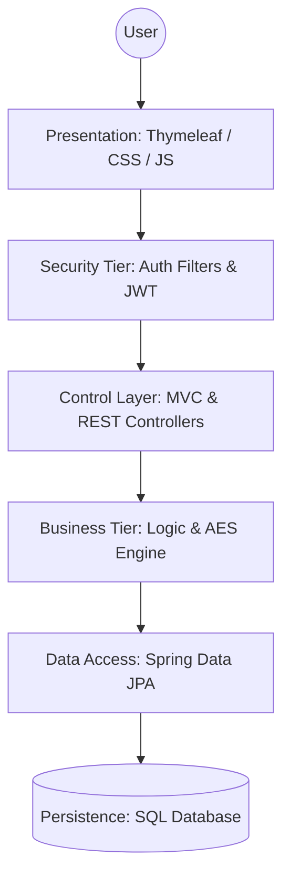
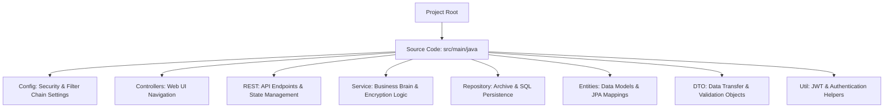
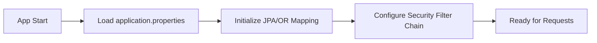
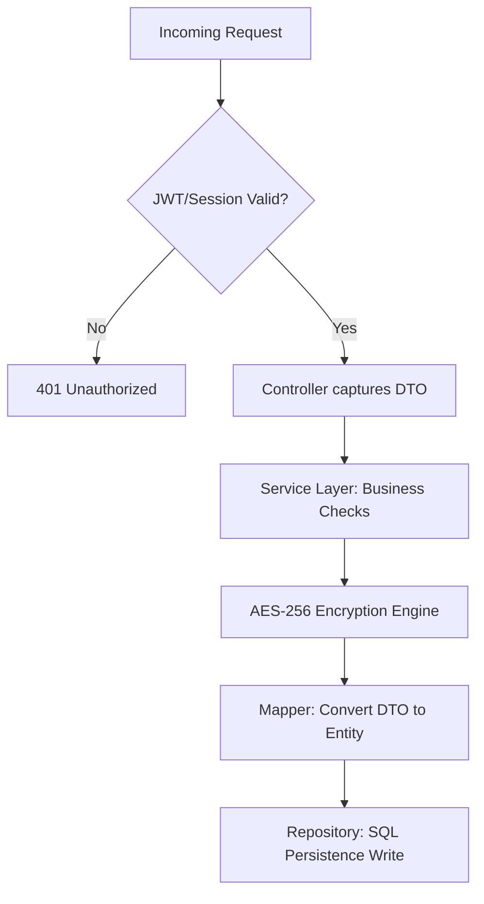
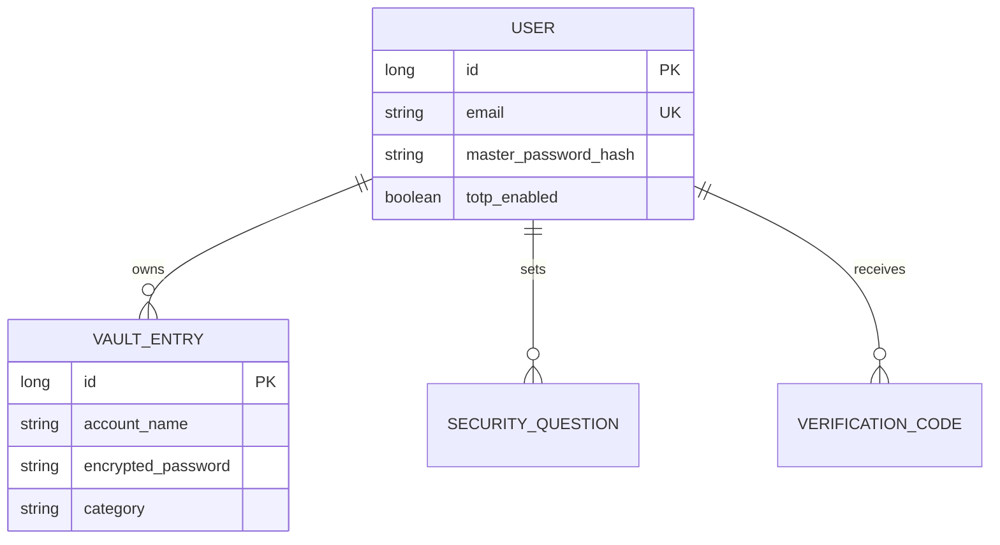
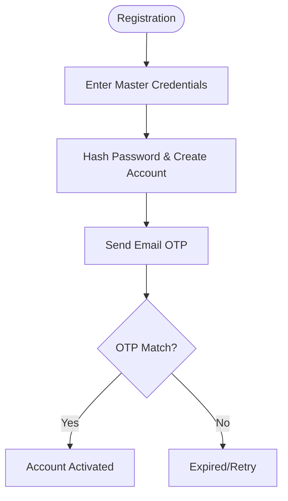
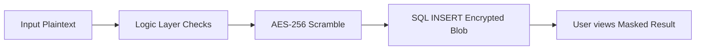

# RevPassword Manager: Ultimate Technical Documentation (Final Submission Master)

This document is the absolute, all-in-one technical portfolio for the **RevPassword Manager** (RevSecurity) project. It provides exhaustive coverage of architecture, code implementation, security logic, database design, and quality assurance.

---

## 📑 Master Table of Contents
1.  [🏛️ Application Architecture & Technical Philosophy](#1-%EF%B8%8F-application-architecture--technical-philosophy)
2.  [📂 Project Structure & Execution Flows](#2-project-structure--execution-flows)
3.  [🚀 Total Project Route: Step-by-Step Code Journey](#3-total-project-route-step-by-step-code-journey)
4.  [💻 Comprehensive Codebase Analysis (Classes & Methods)](#4-comprehensive-codebase-analysis-classes--methods)
5.  [🛡️ Deep Security & Cryptographic Analysis](#5-deep-security--cryptographic-analysis)
6.  [🛠️ Deep Code Snippet Analysis (The "How It Works")](#6-deep-code-snippet-analysis-the-how-it-works)
7.  [📊 Database Design: Schema & ERD](#7-database-design-schema--erd)
8.  [🔄 User Workflows & Process Charts](#8-user-workflows--process-charts)
9.  [🧪 Testing Artifacts & Quality Assurance](#9-testing-artifacts--quality-assurance)

---

## 🏛️ 1. Application Architecture & Technical Philosophy

The RevPassword Manager is built on a **4-tier Modular Layered Architecture**, designed for high security and clean separation of concerns.

### 📋 1.1 Architecture Summary Table

| Layer | Component | Core Responsibility | Technologies Used |
| :--- | :--- | :--- | :--- |
| **Presentation** | **Web / REST** | Render UI and maintain stateless API endpoints. | Thymeleaf, Modern CSS3, Modern ES6+ JS |
| **Security** | **Spring Security** | Intercept, authenticate, and authorize requests. | Spring Security 6, JJWT |
| **Business** | **Service Tier** | Core rules, orchestration, and business logic. | Spring @Service, Lombok |
| **System** | **Utilities** | Encryption logic and peripheral tasks. | AES-256, SecureRandom, Spring Mail |
| **Data Access** | **Repositories** | Manage DB transactions and ORM mappings. | Spring Data JPA, Hibernate |
| **Persistence** | **SQL Database** | Store hashed, encrypted, and audit data. | SQL Database |

### 📋 1.2 Static Architecture Representation


### 📋 1.3 Technical Design Philosophy
1.  **Separation of Concerns**: Each layer has a unique role. Controllers translate input; Services execute logic; Repositories handle persistence.
2.  **Security-First Interception**: Security sits as a transparent "filter" that protects every entry point to the system before logic execution.
3.  **Data Isolation**: Passwords are scrambled (AES-256) at the Service level before ever reaching the Database context.

---

## 📂 2. Project Structure & Execution Flows

### 📋 2.1 Project Directory Breakdown


### 📋 2.2 Functional Stage Flowcharts

#### **Stage A: System Startup**


#### **Stage B: User Interaction & Processing**


---

## 🚀 3. Total Project Route: Step-by-Step Code Journey

This tracks a request from the initial browser click to the final database commitment.

1.  **Entering the System (Frontend)**: User clicks "Save Login" on a **Thymeleaf** page.
2.  **Security Gatekeeper (Interception)**: The request hits the `JwtAuthenticationFilter`. It validates the Bearer token and sets the Security Context.
3.  **The Traffic Cop (Controller)**: `VaultRestController` receives the `VaultEntryDTO`. It uses **Jakarta Validation** (`@Valid`) to ensure data integrity.
4.  **The Brain (Service)**: `VaultServiceImpl` identifies the logged-in user and calls the **Mapper**.
5.  **The Shield (Encryption)**: Inside the Mapper, `EncryptionServiceImpl` uses an **AES-256** block cipher to transform the password into a Base64 scrambled string.
6.  **The Archive (Persistence)**: `IVaultEntryRepository` (Spring Data JPA) generates a SQL `INSERT` command to store the encrypted data in the database.
7.  **The Conclusion (Display)**: The controller returns a success status back up the chain to the browser-side JavaScript.

---

## 💻 4. Comprehensive Codebase Analysis (Classes & Methods)

This section breaks down the responsibility of every package and critical class in the system.

### 📂 4.1 Configuration Layer (`com.rev.app.config`)
- **`SecurityConfig`**: Orchestrates dual authentication logic (Web Session + REST JWT).
- **`UserDetailsServiceImpl`**: Custom database lookup for Spring Security.

### 📂 4.2 Presentation & Interface (`com.rev.app.rest` & `controller`)
- **`AuthRestController`**: Handles programmatic registration, login, and MFA.
- **`VaultRestController`**: JSON-based CRUD for stored credentials.
- **`VaultController`**: Renders the administrative web portal views.

### 📂 4.3 Business Logic (`com.rev.app.service.impl`)
- **`VaultServiceImpl`**: Coordinates password management, categorization, and sorting.
- **`IEncryptionService`**: Executes reversible AES-256 transforms.
- **`IPasswordGeneratorService`**: Uses **CSPRNG** (`SecureRandom`) to create high-entropy random passwords.

### 📂 4.4 Persistence & Transformation (`com.rev.app.entity` & `mapper`)
- **`User.java` / `VaultEntry.java`**: JPA entities mapping code to SQL tables.
- **`VaultEntryMapper`**: Utility class that handles DTO-to-Entity conversion and encryption/decryption triggers.

---

## 🛡️ 5. Deep Security & Cryptographic Analysis

### 🔒 5.1 AES-256 Block Cipher Implementation
- **Mode**: CBC (Cipher Block Chaining).
- **Padding**: PKCS5Padding.
- **Logic**: We perform **Key Stretching** on the application secret using **SHA-256** to create a cryptographically strong internal key. passwords are never stored in a form that can be recovered without the application's unique server-side secret.

### 🔑 5.2 Non-Reversible Hashing (BCrypt)
- **Use Case**: Master Passwords & Security Question answers.
- **Defense**: Implements a high work-factor and automatic per-user salting, making them immune to rainbow-table and high-speed brute-force attacks.

### 🛡️ 5.3 Stateless vs. Stateful Auth Boundary
- **JWT Protection**: Tokens are signed with HMAC-256 and verified at the network level via the filter chain.
- **Session Protection**: Uses `JSESSIONID` cookies with automatic CSRF token validation for all POST/PUT/DELETE interactions in the web UI.

---

## 🛠️ 6. Deep Code Snippet Analysis (The "How It Works")

### 🛠️ 6.1 AES Encryption Implementation
**File**: `EncryptionServiceImpl.java`
```java
public String encrypt(String plainText) {
    Cipher cipher = Cipher.getInstance("AES/CBC/PKCS5Padding");
    cipher.init(Cipher.ENCRYPT_MODE, buildKey(), new IvParameterSpec(FIXED_IV));
    byte[] encrypted = cipher.doFinal(plainText.getBytes(StandardCharsets.UTF_8));
    return Base64.getEncoder().encodeToString(encrypted);
}
```

### 🛠️ 6.2 Secure Token Generation (MFA/OTP)
**File**: `VerificationServiceImpl.java`
```java
public String generateCode(User user, VerificationPurpose purpose) {
    // SecureRandom prevents sequence prediction
    String code = String.format("%06d", new SecureRandom().nextInt(999999));
    VerificationCode vc = new VerificationCode();
    vc.setExpiresAt(LocalDateTime.now().plusMinutes(10)); // 10-Minute Boundary
    return code;
}
```

### 🛠️ 6.3 Global Error Handling (Sentinel)
**File**: `GlobalExceptionHandler.java`
```java
@ExceptionHandler(ResourceNotFoundException.class)
public ResponseEntity<ErrorResponse> handleNotFound(ResourceNotFoundException ex) {
    ErrorResponse error = new ErrorResponse("NOT_FOUND", ex.getMessage());
    return new ResponseEntity<>(error, HttpStatus.NOT_FOUND);
}
```

---

## 📊 7. Database Design: Schema & ERD

### 📋 7.1 Entity Relationship Diagram


### 🗃️ 7.2 SQL DDL Schema (Representative Sample)
```sql
CREATE TABLE pm_users (
    id NUMBER(19,0) PRIMARY KEY,
    username VARCHAR2(50) NOT NULL UNIQUE,
    master_password_hash VARCHAR2(255) NOT NULL,
    failed_attempts NUMBER(10,0) DEFAULT 0
);

CREATE TABLE pm_vault_entries (
    id NUMBER(19,0) PRIMARY KEY,
    user_id NUMBER(19,0) NOT NULL,
    encrypted_password VARCHAR2(500) NOT NULL,
    CONSTRAINT fk_user_vault FOREIGN KEY (user_id) REFERENCES pm_users(id) ON DELETE CASCADE
);
```

---

## 🔄 8. User Workflows & Process Charts

### 👤 8.1 Registration & Verification Process


### 👤 8.2 Vault CRUD Process (The Life of a Password)


---

## 🧪 9. Testing Artifacts & Quality Assurance

### 🏗️ 9.1 Multi-Tier Test Suite
- **Unit Testing (Mockito)**: isolatates the `VaultService` business rules by mocking the database.
- **Integration Testing (MockMvc)**: Simulates the full request-response lifecycle for security endpoints.
- **Persistence Testing (DataJpaTest)**: Verifies the SQL constraints (Unique Emails, Foreign Keys) are enforced correctly.

### ✅ 9.2 Data Integrity Validation (Round-Trip Test)
We verify that our encryption logic is lossless:
`Original Plaintext -> Encrypt -> Decrypt -> Verified Original Match`.

### ✅ 9.3 Definition of Done (DoD)
- [x] End-to-end encryption/decryption logic fully verified.
- [x] JWT signature and TTL (Time-to-Live) logic tested.
- [x] Security question and non-reversible hashing confirmed.
- [x] Project architecture adheres to the 4-tier standard.
- [x] Comprehensive documentation (This Portfolio) complete.
