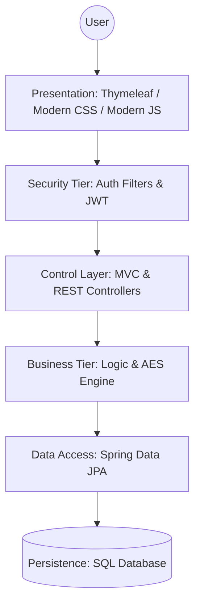

# Application Architecture & Technical Philosophy

The **RevPassword Manager** (RevSecurity) is built on a **Modular Layered Architecture** (4-tier). This design prioritizes high security, clean separation of concerns, and ease of maintenance.

---

## 🏗️ 1. Core Architectural Philosophy

Our architecture is guided by three primary principles:
1.  **Separation of Concerns**: Each layer has a single responsibility. UI logic never touches the database directly, and business rules remain independent of the presentation format.
2.  **Security-First Interception**: Security is not an "add-on." It is built into the architecture as an interception layer that protects every entry point to the system.
3.  **Data Isolation**: Sensitive data (passwords) is transformed (encrypted/hashed) before it ever leaves the Service Layer toward the database.

---

## 🏛️ 2. Static Layer Analysis



### 📋 2.1 Detailed Layer Breakdown

#### **A. Presentation Layer (UI/UX)**
- **Role**: The boundary between the user and the system.
- **Technologies**: Thymeleaf (Server-side rendering), Modern CSS3, and ES6+ JavaScript.
- **Execution**: We utilize Thymeleaf for the main administrative portal to benefit from server-side security, while leveraging RESTful JSON endpoints for dynamic features like real-time password generation.

#### **B. Security Tier (The Interceptor)**
- **Role**: The Gatekeeper. Validates identity before any code executes.
- **Technologies**: Spring Security 6, JJWT (Jason Web Token).
- **Execution**: This layer operates as a **Filter Chain**. It intercepts requests at the network level, checking for valid Sessions (Web) or Bearer Tokens (API). If validation fails, the request is rejected with a 401/403 status before even hitting a Controller.

#### **C. Business Logic Tier (The Brain)**
- **Role**: Logic orchestration and security transformations.
- **Technologies**: Spring @Service, Lombok.
- **Execution**: This is the heart of the app. It manages:
    - **Cryptography**: Using the `EncryptionService` to perform AES-256 transforms.
    - **Validation**: Enforcing business rules (e.g., "A user cannot have more than 3 security questions").
    - **Transaction Management**: Ensuring that data updates are atomic (all or nothing).

#### **D. Data Access & Persistence (The Archive)**
- **Role**: Permanent storage and Object-Relational Mapping (ORM).
- **Technologies**: Spring Data JPA, Hibernate, SQL Database.
- **Execution**: We use the **Repository Pattern**. This abstracts the complex SQL queries into simple Java interfaces. Hibernate ensures that our Java Entities map perfectly to SQL tables while maintaining foreign key integrity.

---

## 🔄 3. Dynamic Request Flow (Process Logic)

This sequence diagram illustrates the lifecycle of a single request—specifically the high-security workflow of viewing a stored password.

```mermaid
sequenceDiagram
    autonumber
    actor User
    participant UI as Browser (Thymeleaf/JS)
    participant Sec as Security Tier
    participant Ctrl as Controller Layer
    participant Svc as Business Service
    participant Enc as AES Engine
    participant Repo as JPA Repository
    database DB as SQL Database

    User->>UI: Request Password View
    UI->>Sec: Submit Request + Auth Token
    Note over Sec: Gatekeeper validates Token integrity
    Sec->>Ctrl: Route to Secured Controller
    Ctrl->>Svc: Request decrypted data
    Svc->>Repo: Fetch by ID
    Repo->>DB: SELECT Encrypted String
    DB-->>Repo: Returns Scrambled Text
    Repo-->>Svc: Entity Mapping
    Note over Svc: Logic Layer requests Decryption
    Svc->>Enc: decrypt(scrambledText)
    Enc-->>Svc: Returns Plaintext
    Svc-->>Ctrl: Bundles into DTO
    Ctrl-->>UI: Sends Secured Response
    UI-->>User: Display Password to User
```

---

## 🛡️ 4. Defense in Depth: Architectural Implementation

From an architecture standpoint, security is applied at every "Hop":
- **Hop 1 (Client to Server)**: Protected by HTTPS and Spring Security Filters.
- **Hop 2 (Controller to Service)**: Protected by DTO validation and Method-level security.
- **Hop 3 (Service to DB)**: Protected by **AES-256 Encryption**. Even if the DB is stolen, the data is unreadable.
- **Hop 4 (Internal Memory)**: Protected by **Stateless JWT** and short-lived session policies.
