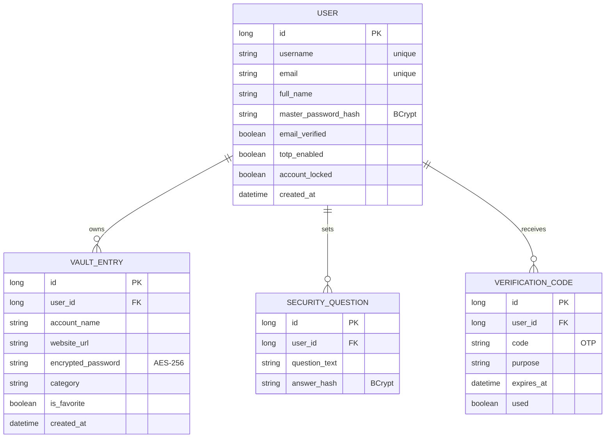

# Entity Relationship Diagram (ERD)

The following diagram illustrates the structural relationships between the core entities of the RevPassword Manager.

```mermaid
erDiagram
    USER ||--o{ VAULT_ENTRY : "owns"
    USER ||--o{ SECURITY_QUESTION : "sets"
    USER ||--o{ VERIFICATION_CODE : "receives"

    USER {
        long id PK
        string username "unique"
        string email "unique"
        string full_name
        string master_password_hash "BCrypt"
        boolean email_verified
        boolean totp_enabled
        boolean account_locked
        datetime created_at
    }

    VAULT_ENTRY {
        long id PK
        long user_id FK
        string account_name
        string website_url
        string encrypted_password "AES-256"
        string category
        boolean is_favorite
        datetime created_at
    }

    SECURITY_QUESTION {
        long id PK
        long user_id FK
        string question_text
        string answer_hash "BCrypt"
    }

    VERIFICATION_CODE {
        long id PK
        long user_id FK
        string code "OTP"
        string purpose
        datetime expires_at
        boolean used
    }
```
