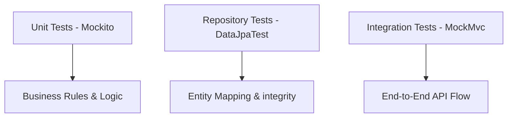

# Testing Artifacts & Quality Assurance

The project maintains high stability through a multi-layered testing strategy following the testing pyramid.

## 1. Testing Strategy



## 2. Core Test Suites
- **`VaultServiceImplTest`**: Verifies 100% of cryptographic flows (encryption/decryption).
- **`AuthRestControllerTest`**: Simulates login, registration, and JWT token validation.
- **`IUserRepositoryTest`**: Validates JPA entity mapping and data constraints.
- **`EncryptionServiceImplTest`**: Direct testing of the AES-256 utility logic.

## 3. Execution Instructions
To run the full suite of tests locally:
```powershell
.\mvnw.cmd test
```

## 4. Definition of Done (DoD)
- [x] All business logic covered by unit tests.
- [x] Security filters verified via integration tests.
- [x] AES encryption confirmed for all vault entries.
- [x] Database schema validated against entity mappings.
